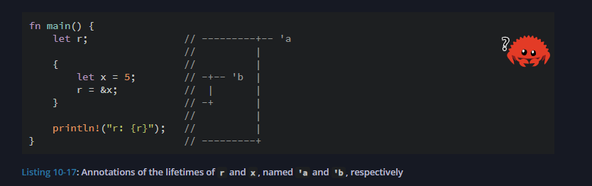

# 🧠 Things Learned In Chapter 10: Generics, Traits, Lifetimes

## Generics

Use generics to write flexible, reusable code by allowing types to be parameters.

> ⚠️ Note: Generics only work with types that support the required operations. You may need to add **trait bounds**.

### ✍️ Defining a Generic Function

```rust
fn largest<T>(list: &[T]) -> &T {
    // ...
}
```

* `T` is a generic type.
* Function returns a reference to the largest item.

### 📂 Generics with Structs

#### Same Type

```rust
struct Point<T> {
    x: T,
    y: T,
}
```

#### Different Types

```rust
struct Point<T, U> {
    x: T,
    y: U,
}
```

### 🖆️ Generics with Enums

```rust
enum Option<T> {
    Some(T),
    None,
}

enum Result<T, E> {
    Ok(T),
    Err(E),
}
```

### 📆 Generics with Method Implementations

```rust
impl<T> Point<T> {
    fn x(&self) -> &T {
        &self.x
    }
}

impl Point<f32> {
    fn distance_from_origin(&self) -> f32 {
        (self.x.powi(2) + self.y.powi(2)).sqrt()
    }
}
```

### 🚀 Different Generics in Method

```rust
impl<X1, Y1> Point<X1, Y1> {
    fn mixup<X2, Y2>(self, other: Point<X2, Y2>) -> Point<X1, Y2> {
        Point {
            x: self.x,
            y: other.y,
        }
    }
}
```

## 🚀 Performance of Generics

* Generics are compiled into concrete types using **monomorphization**.
* No runtime cost!

---

# Traits: Defining Shared Behavior

## ⚖️ Defining a Trait

```rust
pub trait Summary {
    fn summarize(&self) -> String;
}
```

## 🎓 Implementing Traits

```rust
impl Summary for NewsArticle {
    fn summarize(&self) -> String {
        format!("{}, by {} ({})", self.headline, self.author, self.location)
    }
}
```

> ⚠️ **Orphan Rule**: You can implement a trait for a type only if the trait or the type is local to your crate.

## ✅ Default Implementations

```rust
pub trait Summary {
    fn summarize(&self) -> String {
        String::from("(Read more...)")
    }
}
```

```rust
impl Summary for NewsArticle {}
```

* You can also call another method from default methods.

## ⚖️ Traits as Function Parameters

```rust
pub fn notify(item: &impl Summary) {
    println!("Breaking news! {}", item.summarize());
}
```

### Trait Bound Syntax

```rust
pub fn notify<T: Summary>(item: &T) {
    println!("Breaking news! {}", item.summarize());
}
```

## ✏️ Multiple Parameters and Bounds

```rust
pub fn notify(item1: &impl Summary, item2: &impl Summary) {}

pub fn notify<T: Summary>(item1: &T, item2: &T) {}
```

## ➕ Combining Trait Bounds

```rust
pub fn notify(item: &(impl Summary + Display)) {}

pub fn notify<T: Summary + Display>(item: &T) {}
```

### `where` Syntax

```rust
fn some_function<T, U>(t: &T, u: &U) -> i32
where
    T: Display + Clone,
    U: Clone + Debug,
{
    // ...
}
```

---

## Returning Types That Implement Traits

You can use `impl Trait` in return type to return "some type that implements a trait" without specifying exact type:

```rust
fn returns_summarizable() -> impl Summary {
    SocialPost {
        username: String::from("horse_ebooks"),
        content: String::from("of course, as you probably already know, people"),
        reply: false,
        repost: false,
    }
}
```

**Note:** You can only return one concrete type using `impl Trait`. The following won't work:

```rust
fn returns_summarizable(switch: bool) -> impl Summary {
    if switch {
        NewsArticle { ... }
    } else {
        SocialPost { ... }
    }
}
```

Because it's returning two different types (even though both implement Summary).

Something Related TO Closures Did Not Undersntand much.

---

## Using Trait Bounds to Conditionally Implement Methods

You can implement methods conditionally based on trait bounds:

```rust
use std::fmt::Display;

struct Pair<T> {
    x: T,
    y: T,
}

impl<T> Pair<T> {
    fn new(x: T, y: T) -> Self {
        Self { x, y }
    }
}

impl<T: Display + PartialOrd> Pair<T> {
    fn cmp_display(&self) {
        if self.x >= self.y {
            println!("The largest member is x = {}", self.x);
        } else {
            println!("The largest member is y = {}", self.y);
        }
    }
}
```

You can also define **blanket implementations**:

```rust
impl<T: Display> ToString for T {
    // Now any type that implements Display also implements ToString
}

let s = 3.to_string(); // i32 implements Display, so also ToString
```

This allows powerful trait composition while still preserving compile-time safety and performance.

-----

# 🧬 Lifetimes

the scope for which that reference is valid

---

## 📦 Borrow Checker

The Rust compiler has a **borrow checker** that compares scopes to determine whether all borrows are valid



---

## ✨ We Need To Specify Generic Lifetime Annotations When Borrow Checker Cannot Comprehend It:

    &i32        // a reference
    &'a i32     // a reference with an explicit lifetime
    &'a mut i32 // a mutable reference with an explicit lifetime

---

## 🧠 Lifetime Annotations in Struct Definitions

The lifetimes come into picture for Structs when we want to hold references

    struct ImportantExcerpt<'a> {
        part: &'a str,
    }

    fn main() {
        let novel = String::from("Call me Ishmael. Some years ago...");
        let first_sentence = novel.split('.').next().unwrap();

        let i = ImportantExcerpt {
            part: first_sentence,
        };
    }

This annotation means an instance of ImportantExcerpt can’t outlive the reference it holds in its `part` field.

---

## 🔍 Lifetime Elision Rules

They’re a set of particular cases that the compiler will consider, and if your code fits these cases, you don’t need to write the lifetimes explicitly.

    📌 Lifetimes on function or method parameters → "input lifetimes"
    📌 Lifetimes on return values → "output lifetimes"

### ✅ Rule 1:

The compiler assigns a lifetime parameter to each parameter that’s a reference.

    fn foo<'a>(x: &'a i32);
    fn foo<'a, 'b>(x: &'a i32, y: &'b i32);

### ✅ Rule 2:

If there is exactly one input lifetime parameter, that lifetime is assigned to all output lifetime parameters.

    fn foo<'a>(x: &'a i32) -> &'a i32

### ✅ Rule 3:

If there are multiple input lifetimes, but one is &self or &mut self, the lifetime of self is assigned to all output lifetime parameters.

    impl<'a> MyStruct<'a> {
        fn get_value(&self) -> &'a str;
    }

If compiler fails to apply all of these rules, it gives an error — and it's our responsibility to manually annotate lifetimes.

---

## ✍️ Implementing These Rules Manually

### Rule 1:

    fn first_word(s: &str) -> &str {}
    |
    fn first_word<'a>(s: &'a str) -> &str {}

### Rule 2: (Continue)

    fn first_word<'a>(s: &'a str) -> &'a str {}

Done! ✅

---

## 🧪 Example Where Manual Lifetime Required

    fn longest(x: &str, y: &str) -> &str {}

Apply Rule 1:

    fn longest<'a, 'b>(x: &'a str, y: &'b str) -> &str {}

❌ Rule 2 not applicable because 2 input lifetimes

❌ Rule 3 not applicable because not a method

So we manually annotate:

    fn longest<'a>(x: &'a str, y: &'a str) -> &'a str

Now ✅ Works!

---

## 🛠️ Lifetime Annotations in Method Definitions

    impl<'a> ImportantExcerpt<'a> {
        fn announce_and_return_part(&self, announcement: &str) -> &str {
            println!("Attention please: {announcement}");
            self.part
        }
    }

Thanks to Rule 3, the output lifetime is tied to self's lifetime.

---

## 🏁 Static Lifetime

    let s: &'static str = "I have a static lifetime.";

The text of this string is stored directly in the program’s binary → it lives for the entire duration of the program.

All string literals have `'static` lifetime.

