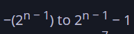
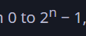
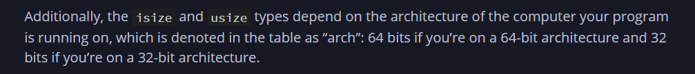
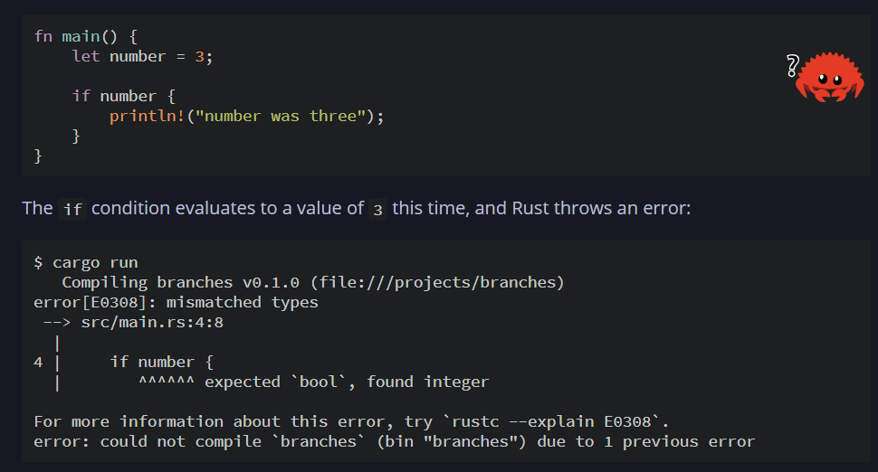
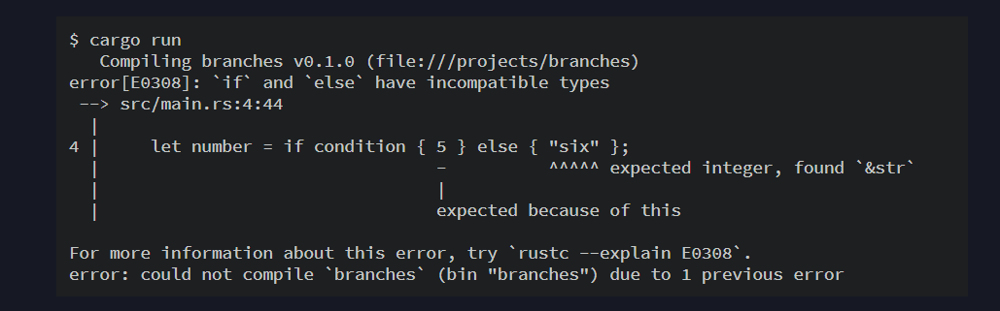

# Things Learned In this Third chapter:

## Shadowing using let 

        let x = 5;

        let x = x + 1; Shadowing is done with let 

        But x = 4        Does not works 

## Mutable variable types

        let mut x=5

## Signed:

## Unsigneed:

## Additionally

    The isize and usize

## Without semicolon return 

    fn test()->i32{
        5
    }

    fn test2()->i32{
        5; -------> This does not works why because of ; as it returns ()
    }

 Rust will not automatically try to convert non-Boolean types to a Boolean.

 

 
 
    This won’t work because variables must have a single type, and Rust needs to know at compile time what type the number variable is, definitively. Knowing the type of number lets the compiler verify the type is valid everywhere we use number. Rust wouldn’t be able to do that if the type of number was only determined at runtime