# 🧠 Things Learned In Chapter 4: Ownership and Memory in Rust

---

## 🪜 Stack and Heap Memory

* **Stack Memory**: Fast, efficient, uses LIFO (Last In First Out)
* **Heap Memory**: Slower, used for types like `String`, `Vec`
* Rust replaces garbage collection with the **ownership model** to manage memory efficiently.

---

## 🧵 Ownership Rules

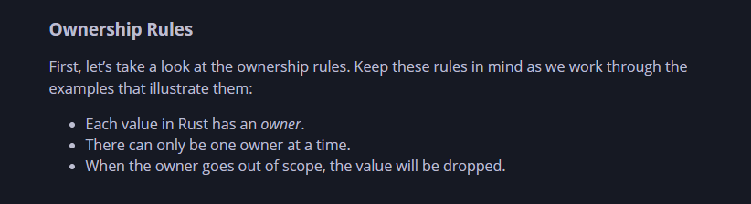

---

## ✨ Literals vs `String::from("...")`

```rust
let s = "hello";                // Stored on Stack
let s = String::from("hello");  // Stored on Heap
```

---

## 🔄 Shallow Copy

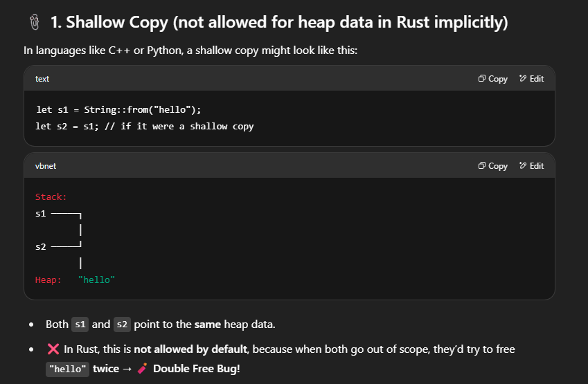

---

## ⚡ Move Semantics (Not Shallow Copy)

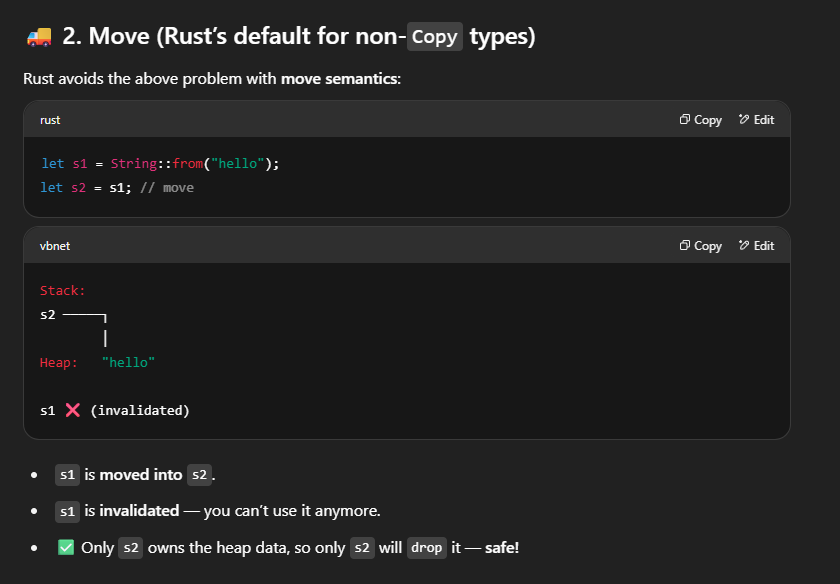

---

## 🔧 Deep Copy with `clone()`

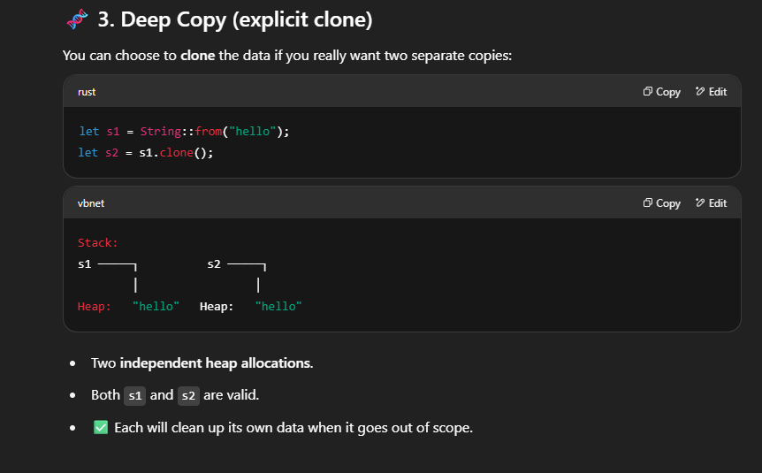

---

## ✔️ Copy Trait

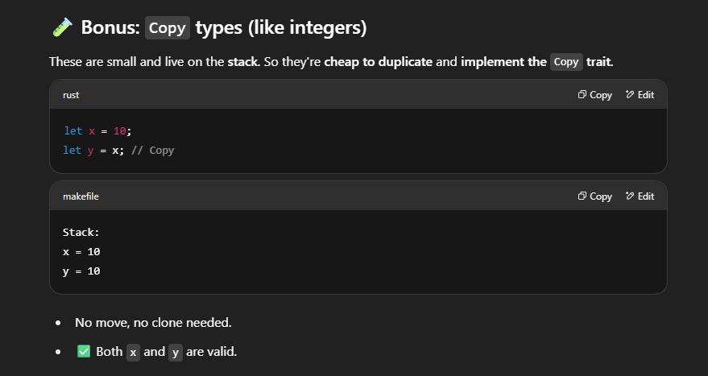

---

## 🤨 Clone Trait

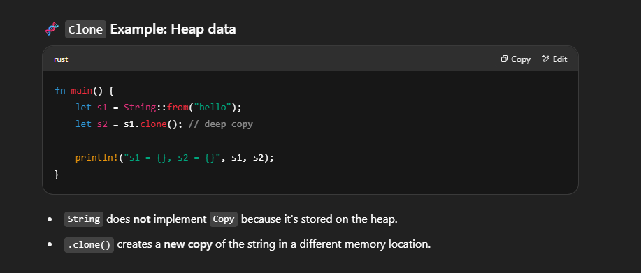

> The `Copy` trait is for types stored **only on the stack**.

---

## 🧱 Stack-Only Types Implement `Copy`

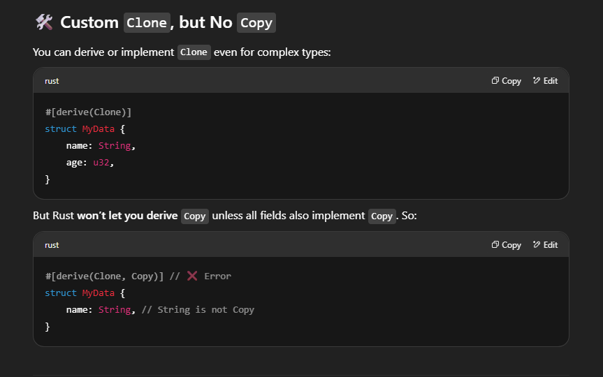

---

## 📌 References Without Ownership Transfer

* One **mutable** reference allowed
* Multiple **immutable** references allowed

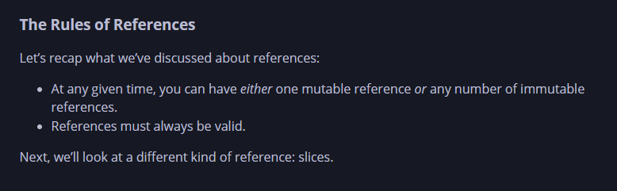

---

## 💧 Mutable Referencing

```rust
let mut x = String::from("hello");

let r1 = &x;       // Immutable reference
let r2 = &mut x;   // Mutable reference ❌ Not allowed with r1
```

---

## ⚠️ Dangling Pointers Prevention

Rust prevents dangling pointers at **compile time**.


---

## 📃 `.as_bytes()` and Byte Literals

```rust
let s = String::from("hello");
let bytes = s.as_bytes(); // &[u8]

let space = b' ';         // byte literal, value: 32
```

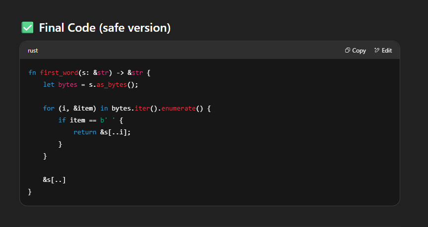
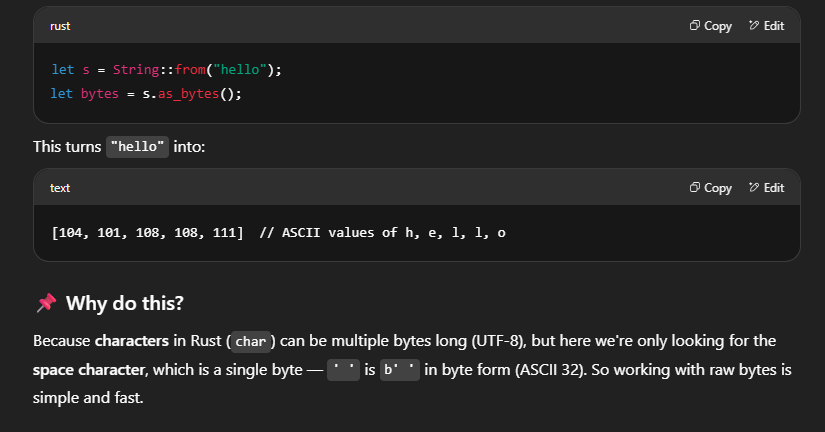

---

## 📂 String Slices

* Use slices to work with **parts** of a `String`
* Avoids unnecessary cloning

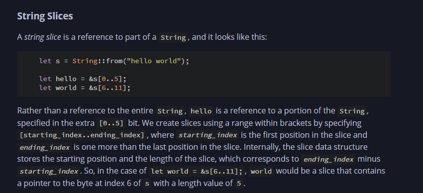

---


