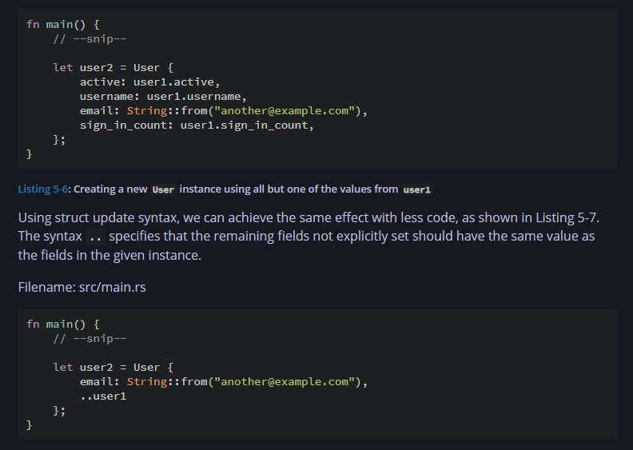

# 🧠 Things Learned In Chapter 5: Understanding Structs in Rust

---

## 🧱 Creating a Struct and Adding Mutability

We can create structs with fields of different data types. Structs can be mutable, but the mutability applies to the **entire struct**, not individual fields.

```rust
let mut user = User {
    name: String::from("Yatharth"),
    age: 21,
    logged_in: false,
};
```

---

## 🧪 Creating a New Struct from an Existing One



* `String` is a heap-allocated type and does **not** implement the `Copy` trait.
* `String` implements the `Drop` trait, so Rust enforces **move semantics**.

```rust
let user2 = User {
    username: String::from("test"),
    ..user1
};
```

> ❌ `user1.username` — Cannot be used anymore (moved)
> ✅ `user1.email` — Still valid if it implements `Copy`

---

## 🧮 Tuple Struct

```rust
struct Point(i32, i32, i32);

let origin = Point(0, 0, 0);
```

---

## 🔹 Unit Struct

A **unit-like struct** is a struct with **no fields** — like `()` in Rust. Acts like a placeholder type.

```rust
struct Logger;

impl Logger {
    fn log(&self) {
        println!("Logging in");
    }
}

let log = Logger;
log.log();
```

---

## 🧷 Ownership of Structs

Using `String` vs `&str`:

* **With `String`**: Owns the data — lives as long as the struct instance.
* **With `&str`**: A reference — needs **lifetimes**.

---

## 🖨️ `println!` Macro Formatting with Structs

```rust
let rect1 = Rectangle {
    height: 100,
    width: 100,
};

println!("fjfn {}", rect1); // ❌ Does not work
```

* `Display` works for **primitive types** only.
* For custom structs, add:

```rust
#[derive(Debug)]
```

### Debug Output Styles:

```rust
println!("struct {new_user:?}");       // ✅ Modern Debug
println!("struct second {:?}", new_user); // ✅ Classic Debug
println!("Pretty {:#?}", new_user);       // ✅ Pretty debug format
```

---

# 🦀 Structs, `self`, and Getters in Rust

## 📦 Structs in Rust

```rust
struct User {
    name: String,
    age: u8,
    logged_in: bool,
}
```

> By default, all fields in a struct are **private**.

---

## 🧠 `impl` Blocks and `self`

```rust
impl User {
    pub fn name(&self) -> &str {
        &self.name
    }
}
```

### Types of `self`

| Type        | Meaning                      | Use Case                          |
| ----------- | ---------------------------- | --------------------------------- |
| `&self`     | Immutable borrow of instance | Read-only access to data          |
| `&mut self` | Mutable borrow               | Mutate internal fields            |
| `self`      | Takes ownership              | Consume or transform the instance |

> `self` is shorthand for `self: &Self`, `self: &mut Self`, or `self: Self`

---

## 🔐 Why Use Getter Methods?

Rust doesn’t auto-generate getters. You write them to:

* Expose read-only access
* Encapsulate internal fields
* Allow safe future refactoring

```rust
impl User {
    pub fn name(&self) -> &str {
        &self.name
    }
}
```

```rust
let user = User {
    name: String::from("Yatharth"),
    age: 21,
    logged_in: false,
};

println!("{}", user.name()); // ✅
println!("{}", user.name);   // ❌ Field is private
```

---

## 🚧 Public vs Private

```rust
pub struct User {
    name: String,
}

impl User {
    pub fn name(&self) -> &str {
        &self.name
    }
}
```

> Using `pub fn` is cleaner and more flexible than exposing fields.

---

## 🌐 Comparison with Other Languages

| Language       | Default Access | Auto-Generated Getters     | Custom Logic? |
| -------------- | -------------- | -------------------------- | ------------- |
| **Rust**       | Private        | ❌ No                       | ✅ Yes         |
| **C**          | Public         | ❌ No                       | ❌ Manual only |
| **Java**       | Private        | ✅ Yes (IDE support)        | ✅ Yes         |
| **Python**     | Public         | ❌ Optional via `@property` | ✅ Yes         |
| **JavaScript** | Public         | ❌ Optional via `get`       | ✅ Yes         |

---

## 💡 Final Takeaways

* Use `&self` for read-only methods.
* Avoid `pub` on fields unless absolutely needed.
* Write getters to encapsulate access.
* Use `impl` to organize behavior.

> 🔒 Field privacy is enforced only **across files/modules**. If your struct and usage are in the **same file**, fields are accessible.

---

## 📌 Associated Functions (With or Without `self`)

```rust
impl Rectangle {
    fn area(&self) -> u32 {
        self.width * self.height
    }

    fn can_hold(&self, other: &Rectangle) -> bool {
        self.width > other.width && self.height > other.height
    }
}
```

```rust
fn main() {
    let rect1 = Rectangle { width: 30, height: 50 };
    let rect2 = Rectangle { width: 10, height: 40 };

    println!("Can rect1 hold rect2? {}", rect1.can_hold(&rect2));
}
```

---

## 🧩 Types of Associated Functions

* **Methods** (have `self` as first param)
* **Non-methods** (constructors, helpers)

### Example:

```rust
impl Rectangle {
    fn square(size: u32) -> Self {
        Self {
            width: size,
            height: size,
        }
    }
}

let sq = Rectangle::square(3); // ✅
```

> `Self` refers to the type itself (like `Rectangle`), not a specific instance.

---
