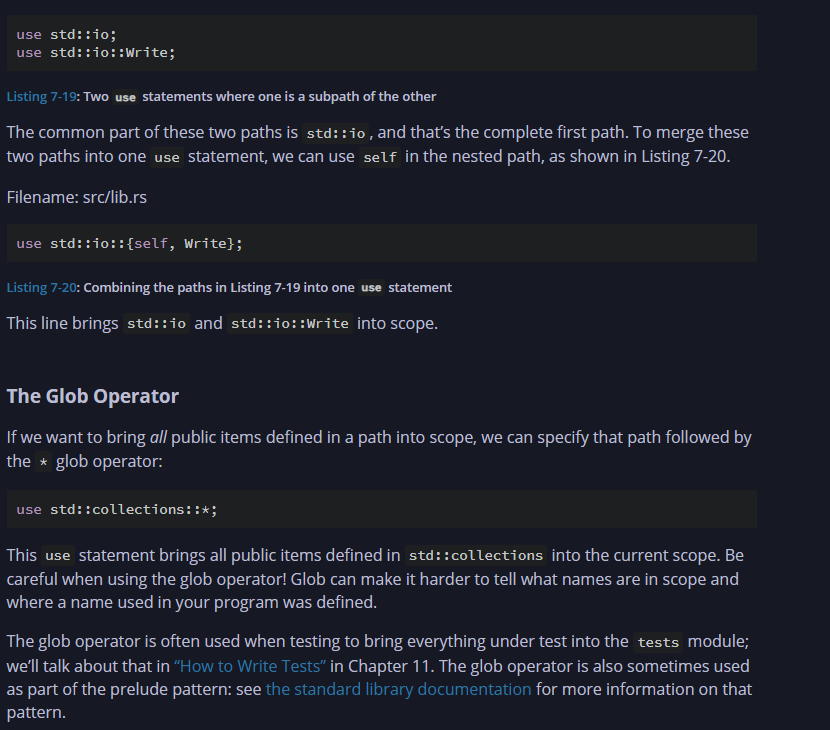
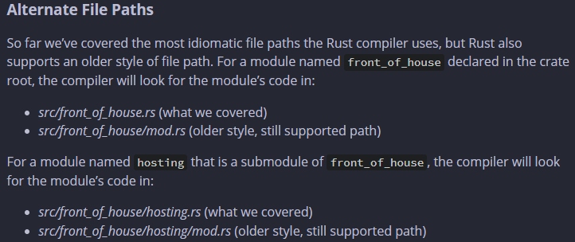

# 🧠 Things Learned In Chapter 7: Managing A Project

| Concept     | What it Is                            | Role in Rust Project                          |
| ----------- | ------------------------------------- | --------------------------------------------- |
| **Package** | A complete project folder (via Cargo) | Defines and ships 1+ crates                   |
| **Crate**   | A single compilation unit             | Produces binary (main.rs) or library (lib.rs) |
| **Module**  | Logical unit inside a crate (`mod`)   | Organizes and groups related code             |
| **Path**    | Reference to items like functions     | Used to access code from other modules/files  |


## 📦 Packages and 🧱 Crates

### 🔹 What is a Crate?

* A **crate** is the smallest unit of code the Rust compiler can compile.
* Every single `.rs` file you compile is treated as a crate.
* Crates can be of two types:

  * ✅ **Binary Crate**:

    * Has a `main()` function
    * Compiles into an executable
    * Example: `main.rs`, `bin/tool.rs`
  * 📚 **Library Crate**:

    * Has no `main()` function
    * Provides reusable functions, structs, traits, etc.
    * Is **used by** binary crates or other libraries
    * Example: `lib.rs`

> 📁 The file where the crate starts compiling is called the **crate root** (e.g., `main.rs` or `lib.rs`).

### 📦 What is a Package?

* A **package** is a bundle of one or more crates.
* Must contain a `Cargo.toml`
* A package:

  * Can contain **multiple binary crates**
  * Can contain **only one library crate**

```bash
cargo new my_project       # Binary crate by default
cargo new my_lib --lib     # Library crate
```

---

## 📂 File Layout and Execution

```txt
my_project/
├── Cargo.toml       ← Defines the package
├── src/
│   ├── main.rs      ← Default binary crate
│   ├── lib.rs       ← Optional shared library crate
│   └── bin/
│       ├── help.rs  ← Additional binary crate
```

### 🚀 Running Crates

```bash
cargo run                  # Runs src/main.rs
cargo run --bin help       # Runs src/bin/help.rs
```

> 🧠 `help.rs` is NOT executed when running `cargo run`. Only `main.rs` is.

### 🔄 Sharing Code

* **Binary crates do NOT automatically see each other's code**.
* To share code between `main.rs` and `help.rs`, you must place shared logic in `lib.rs`:

```rust
// src/lib.rs
pub fn greet() {
    println!("Hello from lib!");
}

// src/main.rs
use my_project::greet;
fn main() {
    greet();
}
```

---

## 🔐 Modules, Scope, and use

### 📁 Modules

* Organize related code into reusable units
* Defined with `mod` and can be in the same file or in sub-files:

```rust
mod utils; // loads utils.rs or utils/mod.rs
```

### 🔒 Privacy and Scope

* By default, everything is `private`.
* Use `pub` to make items accessible:

```rust
pub fn visible_fn() {}
```

### 📚 Paths and use

* **Path**: How you access a module/item (like `utils::math::add`)
* **use**: Bring items into scope:

```rust
use crate::utils::math::add;
```

---

## 🤔 Questions You Asked — Answered

### ❓ Is each file a crate?

* **Only if it's in**:

  * `src/main.rs` → main binary crate
  * `src/lib.rs` → library crate
  * `src/bin/*.rs` → additional binary crates
* `help.rs` beside `main.rs` in `src/` **won’t be treated as a crate**.

### ❓ What does `cargo run` do?

* It **compiles and runs** the binary crate at `src/main.rs` only.
* Other binaries like `help.rs` **won’t be compiled or run unless explicitly invoked**.

### ❓ Can `main.rs` use code from `help.rs`?

* ❌ Not directly — each binary is a separate crate.
* ✅ Instead, move shared logic to `lib.rs`, then import it.

### ❓ Why only one `lib.rs`?

* Because a package can only have one **library crate**.
* Multiple libraries would break Cargo’s convention of where to start compiling reusable logic.

### ❓ How is this like JavaScript (npm)?

| Rust            | JavaScript/npm                    |
| --------------- | --------------------------------- |
| `main.rs`       | `index.js`                        |
| `lib.rs`        | `lib/` or `utils/index.js`        |
| `bin/help.rs`   | `scripts/help.js` or CLI commands |
| `cargo build`   | `npm run build`                   |
| `cargo run`     | `node index.js`                   |
| `cargo install` | `npm install -g`                  |

> 🔁 Think of `lib.rs` like a shared module exported and used by all other files in the project.

---

## 🧠 Conclusion

* **Packages** hold one or more crates.
* **Crates** are either binary (executable) or library (reusable).
* You organize logic into **modules**, expose them with `pub`, and bring them into scope with `use`.
* Shared logic? Extract to `lib.rs`.
* More than one CLI tool? Place each in `src/bin/`.

SO why do we need a bin/help.rs or any other binary crate other than main.rs and library crate lib.rs because for additonal help stuff like docs for a cli app  💪

---

## 🧭 How the Compiler Finds Modules

### 🔍 When You Write:

```rust
mod garden;
```

Compiler looks in this order:

1. **Inline:**

```rust
mod garden {
   // code here
}
```

2. **File:** `src/garden.rs`
3. **Directory:** `src/garden/mod.rs`

### 🔍 For Submodules

If in `garden.rs` you write:

```rust
mod vegetables;
```

Compiler checks:

* Inline block inside `garden.rs`
* `src/garden/vegetables.rs`
* `src/garden/vegetables/mod.rs`

> ✅ Rule: The **folder name should match the module name** when using nested paths.

---

## 🔐 pub vs mod vs use — Module Visibility & Access

| Keyword | Purpose                                             |
| ------- | --------------------------------------------------- |
| `mod`   | Declares a module (inline or in another file)       |
| `pub`   | Makes a module or item accessible outside its scope |
| `use`   | Brings paths into scope to simplify usage           |

### Example:

```rust
// main.rs
use crate::garden::vegetables::Asparagus;

pub mod garden;

fn main() {
    let plant = Asparagus {};
    println!("I'm growing {:?}!", plant);
}
```

```rust
// garden.rs
pub mod vegetables;
```

```rust
// garden/vegetables.rs
#[derive(Debug)]
pub struct Asparagus {}
```

---

## 🧰 When to Use `help.rs` or `src/bin/*.rs`

Imagine a CLI project:

* `main.rs` ➡️ `cargo run` — starts the app
* `help.rs` ➡️ `cargo run --bin help` — shows CLI help
* `lib.rs` ➡️ Shared logic used by both `main` and `help`

```bash
src/
├── lib.rs          # Common helpers and logic
├── main.rs         # Binary 1
└── bin/
    └── help.rs     # Binary 2
```

---

## 🔁 Analogy with Node.js

| Rust Concept   | Node.js Equivalent       |
| -------------- | ------------------------ |
| `Cargo.toml`   | `package.json`           |
| `src/main.rs`  | `index.js` or `main.js`  |
| `lib.rs`       | Shared modules           |
| `src/bin/*.rs` | Other CLI commands/tools |
| `use`          | `require()` / `import`   |

---

## Difference Between Crate And Module I got a bit confused

| Concept     | Is it a binary? | Description                                                                |
| ----------- | --------------- | -------------------------------------------------------------------------- |
| `main.rs`   | ✅ Yes           | Binary crate root (must have `fn main`)                                    |
| `lib.rs`    | ❌ No            | Library crate root (reusable APIs/functions)                               |
| Modules     | ❌ No            | Just **namespaces** / containers of related code inside a crate            |
| `garden.rs` | ❌ No            | A module file, part of a crate (e.g., declared with `mod garden;` in root) |


A crate is the top-level compilation unit. 

## Module Tree

      mod front_of_house {
        mod hosting {
            fn add_to_waitlist() {}

            fn seat_at_table() {}
        }

        mod serving {
            fn take_order() {}

            fn serve_order() {}

            fn take_payment() {}
        }
    }

`Looks Like This` : 

    crate
    └── front_of_house
        ├── hosting
        │   ├── add_to_waitlist
        │   └── seat_at_table
        └── serving
            ├── take_order
            ├── serve_order
            └── take_payment


## Paths

  Items in a parent module can’t use the private items inside child modules, but items in child modules can use the items in their ancestor modules. This is because child modules wrap and hide their implementation details, but the child modules can see the context in which they’re defined.

  Thumb Rule All the things in your path should be pub in the example we did not add pub to mod front_of_house because the funtion and the mod a re siblings but that does not mean funciton can utilise the elements inside the module it can see but not use that is why we need to make everttyhting public whichever funciton you want

  Remeber Making A Struct Module Enum Public does not give you access or does not make the inside elements public

## Making Struct Public:

     If we use pub before a struct definition, we make the struct public, but the struct’s fields will still be private


---

        mod back_of_house {

        pub struct Breakfast {
            pub toast: String,

            seasonal_fruit: String,
        }

        impl Breakfast {

            pub fn summer(toast: &str) -> Breakfast {
                Breakfast {

                    toast: String::from(toast),
                    seasonal_fruit: String::from("peaches"),
                }

            }
        }
    }

---

    pub fn eat_at_restaurant() {

        // Order a breakfast in the summer with Rye toast.

        let mut meal = back_of_house::Breakfast::summer("Rye");
        
        // Change our mind about what bread we'd like.
        meal.toast = String::from("Wheat");

        println!("I'd like {} toast please", meal.toast);

        // The next line won't compile if we uncomment it; we're not allowed
        // to see or modify the seasonal fruit that comes with the meal.
        // meal.seasonal_fruit = String::from("blueberries");
    }

---

    Also, note that because back_of_house::Breakfast has a private field, the struct needs to provide a public associated function that constructs an instance of Breakfast (we’ve named it summer here). If Breakfast didn’t have such a function, we couldn’t create an instance of Breakfast in eat_at_restaurant because we couldn’t set the value of the private seasonal_fruit field in eat_at_restaurant.

## Making Enums Public:

    mod back_of_house {
    pub enum Appetizer {
        Soup,
        Salad,
    }
    }

    pub fn eat_at_restaurant() {
        let order1 = back_of_house::Appetizer::Soup;
        let order2 = back_of_house::Appetizer::Salad;
    }


## Using super for better paths:

  super works for going one up the current stage of module tree

   super = “go up one level in module hierarchy”

    Use it when calling parent module code from a child module


✅ Access Rules

    ❌ Parent modules cannot use private items of their child modules.

    ✅ Child modules can use public items from their parent modules.

    This is because child modules are implementation details — they wrap things up. Parent modules can "see" the child, but can’t use anything unless it’s public (pub).

---

<br/>

📌 Thumb Rule

    🔒 Every component (modules, structs, enums, functions) in your path must be pub if you want to access it from outside.

    ✅ In our example, we didn't add pub to mod front_of_house because it is defined in the same scope as the function calling it — they are siblings.

    ❌ But this doesn't mean you can use its content without marking them as pub.
---


📍 Important Reminder

    Making a struct, module, or enum pub does not make its internal fields or functions public.


<br/>

---

<br/>

🧱 Making Structs Public

    Even if the struct is pub, its fields are private by default.

    mod back_of_house {
      pub struct Breakfast {
          pub toast: String,           // ✅ accessible
          seasonal_fruit: String,      // ❌ private
      }

    impl Breakfast {
        pub fn summer(toast: &str) -> Breakfast {
            Breakfast {
                toast: String::from(toast),
                seasonal_fruit: String::from("peaches"),
            }
        }
    }

    }

Usage:
  
    pub fn eat_at_restaurant() {
    let mut meal = back_of_house::Breakfast::summer("Rye");

    meal.toast = String::from("Wheat");
    println!("I'd like {} toast please", meal.toast);

    // ❌ ERROR: can't access private field
    // meal.seasonal_fruit = String::from("blueberries");
    }

☝️ Note

    We added a public method summer to construct a Breakfast because we can’t directly set private fields like seasonal_fruit.

---
<br/>

🧱 Making Enums Public

    Unlike structs, making an enum pub makes all its variants public automatically:

    mod back_of_house {
    pub enum Appetizer {
        Soup,
        Salad,
     }
    }

    pub fn eat_at_restaurant() {
        let order1 = back_of_house::Appetizer::Soup;
        let order2 = back_of_house::Appetizer::Salad;
    }

## Using The use Keyword To Bring Things To Scope:

    mod front_of_house {
    pub mod hosting {
        pub fn add_to_waitlist() {}
      }
    }

    use crate::front_of_house::hosting;

    pub fn eat_at_restaurant() {
        hosting::add_to_waitlist();
    }

---

    But With use it is only accesible to the scope if we do something like this:

    mod front_of_house {
    pub mod hosting {
        pub fn add_to_waitlist() {}
      }
    }

    use crate::front_of_house::hosting;

    mod customer {
        pub fn eat_at_restaurant() {
            hosting::add_to_waitlist();
        }
    }

    Whave to use super inside the fn eat at restraunt to use hosting

-------

    For Same kind of funtions coming from different modules 
    use std::fmt::Result;
    use std::io::Result as IoResult; """ as """ keyword

------

## Self and Glob operator



## How Compiler Looks For Files 




