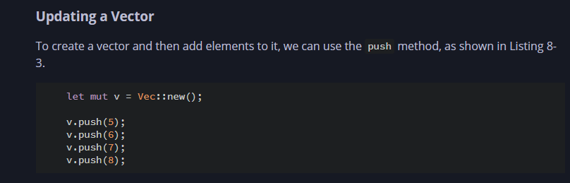
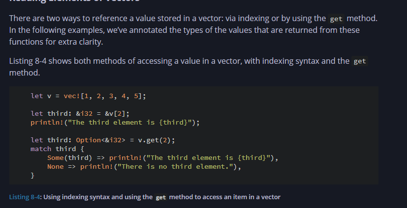
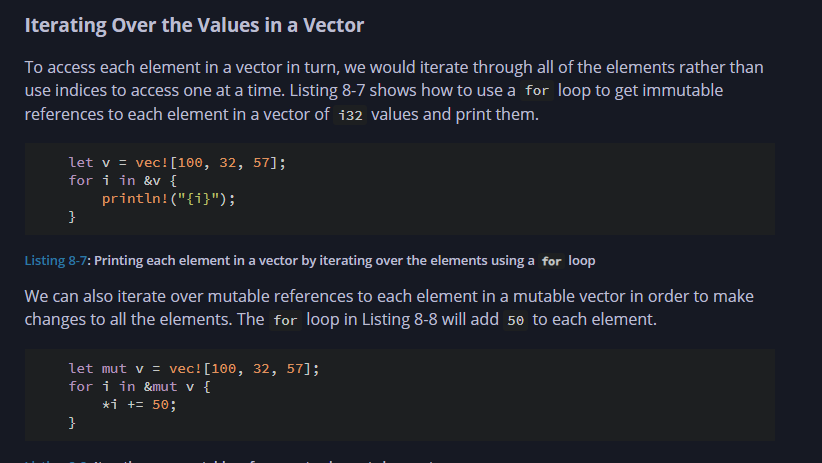

# 🧠 Things Learned In Chapter 8: Collections Vector String And HashMaps

## Creating vector:

        let v: Vec<i32> = Vec::new();
    
    Only Hold Up One Value as we have defined here i32 
    if we directly enter values then no need to specify

    let v = vec![1,2,3]

## Updating



## Indexing or Reading thru get and direct indexing:



    Note:: with get we get options enum so we can handle panic or errors of the program in a better way 


## Iterating Over Values:



## Now The Good Part Using Enums To Store Multiple DataType in vectors

    enum SpreadsheetCell {
        Int(i32),
        Float(f64),
        Text(String),
    }

    let row = vec![
        SpreadsheetCell::Int(3),
        SpreadsheetCell::Text(String::from("blue")),
        SpreadsheetCell::Float(10.12),
    ];


## Strings

## Creating Strings

        let mut s = String::new();

            let data = "initial contents";

            let s = data.to_string();

            // The method also works on a literal directly:
            let s = "initial contents".to_string();

            Similar To

                let s = String::from("initial contents");


## Concatenation with the + Operator or the format! Macro

            let s1 = String::from("Hello, ");
            let s2 = String::from("world!");
            let s3 = s1 + &s2; // note s1 has been moved here and can no longer be used

            Why ??

            Signature of add look like this

            fn add(self, s: &str) -> String {}

# 🧵 Rust Strings: Complete Guide

This `README.md` explains everything you need to know about Strings in Rust: how to create, update, store, and concatenate them, with examples and insights into memory representation.

---

## 🧪 Creating Strings

```rust
let s1 = String::new();
let s2 = String::from("Hello");
let s3 = "World".to_string();
```

* `String::new()` → creates an empty string.
* `String::from()` or `.to_string()` → creates a String from a string slice (`&str`).

---

## 🔁 Updating Strings

### ➕ Appending String Slices

```rust
let mut s = String::from("Hello");
s.push_str(" world!");
```

### ➕ Appending Characters

```rust
s.push('!');
```

---

## 🧱 Internal Representation

* A `String` is a wrapper over `Vec<u8>`.
* It stores text as **UTF-8 encoded bytes**.
* Rust tracks the **number of bytes**, not characters.

### 📏 Example:

```rust
let s = String::from("Здравствуйте");
println!("Length: {}", s.len()); // Output: 24 bytes
```

* Although it has 12 characters, each takes 2 bytes → 12 \* 2 = 24 bytes.

### ❌ Invalid Indexing

```rust
let hello = "Здравствуйте";
let ch = &hello[0]; // ❌ compile error
```

* Because you might access an invalid byte (e.g. `208`) which is not a valid UTF-8 char.

---

## 📦 Unicode Breakdown

For `String::from("नमस्ते")`:

* **Bytes**: 18 bytes
* **Chars**: 6 (`chars().count()`)
* **Human-perceived letters (graphemes)**: 4 (`graphemes(true).count()`, needs external crate)

---

## ➕ Concatenation

### Using `+` Operator

```rust
let s1 = String::from("Hello, ");
let s2 = String::from("world!");
let s3 = s1 + &s2; // s1 is moved, s2 is borrowed
```

* `+` is sugar for `add(self, s: &str)`.
* Takes ownership of `self`, borrows second string.

#### ❓ Why does `&s2` work?

* `&s2` is `&String` → Rust uses **deref coercion** → converts to `&str`

### Chaining `+` Gets Messy

```rust
let s = s1 + "-" + &s2 + "-" + &s3; // readability drops
```

### ✅ Better with `format!` Macro

```rust
let s1 = String::from("tic");
let s2 = String::from("tac");
let s3 = String::from("toe");

let s = format!("{s1}-{s2}-{s3}");
```

* Keeps all strings valid (no ownership moves).
* Easy to read and maintain.

---

## 🔎 Summary Table

| Operation        | Method / Trait     | Ownership      | Returns           |
| ---------------- | ------------------ | -------------- | ----------------- |
| Create           | `String::from()`   | New allocation | `String`          |
| Append \&str     | `.push_str()`      | Mutable borrow | Mutates in place  |
| Append char      | `.push()`          | Mutable borrow | Mutates in place  |
| Concatenate      | `+` operator       | Moves LHS      | New `String`      |
| Concatenate Many | `format!`          | Borrows all    | New `String`      |
| String Length    | `.len()`           | -              | Bytes (not chars) |
| Count Characters | `.chars().count()` | -              | Number of chars   |


## HashMap

        HashMap <K, V>  k: Key V: Value

### Creating A Hashmap:

            use std::collections::HashMap;
            // Not Used Much So Does not exist directly

            let mut scores = HashMap::new();

            scores.insert(String::from("Blue"), 10);
            scores.insert(String::from("Yellow"), 50);

#### Just like vectors, hash maps store their data on the heap

##### hash maps are homogeneous: all of the keys must have the same type, and all of the values must have the same type.

### Accesing Values in HashMap:

    use std::collections::HashMap;

    let mut scores = HashMap::new();

    scores.insert(String::from("Blue"), 10);
    scores.insert(String::from("Yellow"), 50);

    let team_name = String::from("Blue");
    let score = scores.get(&team_name).copied().unwrap_or(0);


 >.get gives Option<&i32>**
<br/>
 > .copied() converts Option<i32> enum**
<br/>
 >  and then unwrap gets the i32 value .copied() dereferneces i32
 > becuase i32 implements copy trait**

### Looping Thru HashMap:

```     
    use std::collections::HashMap;

    let mut scores = HashMap::new();

    scores.insert(String::from("Blue"), 10);
    scores.insert(String::from("Yellow"), 50);

    for (key, value) in &scores {
        println!("{key}: {value}");
    }
```

## HashMaps And Ownership:

    Types Which Implement the copy trait gets copied 
    Where As For string the ownership is moved to hashmap 

    let key=String::form("first");
    let value=String::from("first value");

    let mut newhash=Hashmap::new();
    newhash.insert(key,value);
    Ownership is moved to newhash

### Adding a Key and Value Only If a Key Isn’t Present Using ***.entry***

    Takes the key as input


    use std::collections::HashMap;

    let mut scores = HashMap::new();
    scores.insert(String::from("Blue"), 10);

    scores.entry(String::from("Yellow")).or_insert(50);
    scores.entry(String::from("Blue")).or_insert(50);

    println!("{scores:?}");

    .or_insert return a refernece &mut i32 so you have t odeference it as well with * to update the value


